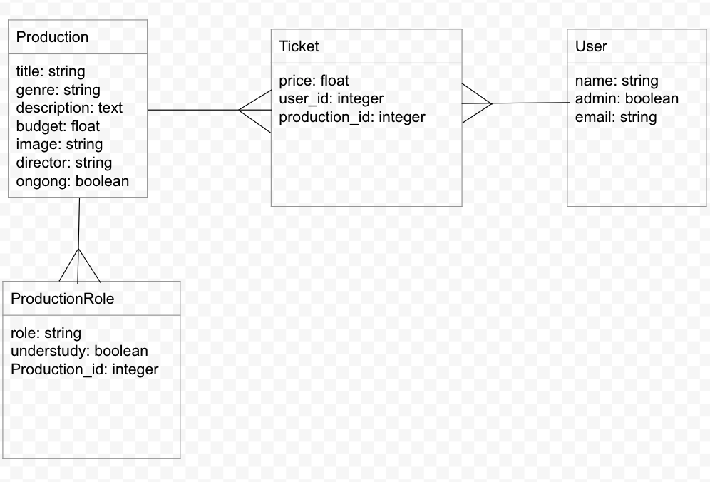

# Phase-4-112221

# Client Server Communication pt1
## SWBAT
- [] Use built in rails validations
- [] Use strong params
- [] Create error handling for validations 
- [] Build out create actions that trigger validations and respond with the appropriate status code

### Domain


### Create Action and strong params
>Note: To review why we use strong params review the `Strong Params and Mass Assignment` on canvas.

To prevent malicious users from abusing mass assignment, rails does not allow params to be passed to `.create`  

Strong params must be use to easily pass params. 

```
# Rails wraps json params in a nested hash. To save us some work, the nested params can be removed. 
#config/initializers/wrap_parameters.rb
wrap_parameters format: []

#app/controllers/production_controller.rb

  def create
    production = Production.create(production_params)
    render json: production, status: :created 
  end 

  private 

  def production_params
    production.permit(:title, :genre, :description, :budget, :image, :director, :ongoing)
  end 


```

### Validations
Validation help maintains accurate valid data.

Validations can be created in the client, database, controller and model.

Rails validates through the model during the `.create` or `.save`

#### Validation Helpers 
Rails has built in validation helpers that can be included in the model. `validates :attribute, validation_helper`

```
class Production < ApplicationRecord
    validates :title, presence: true
end

```

#### Error handling failed Validations 

```
# When a validation fails it's not added to the DB. When testing your validations you can confirm the failure in a few ways. If you look at an instance of a failed validation, it will not have an id.

p1 = Production.create
p1
#<Production id: nil, title: nil, genre: nil, description: nil, budget: nil, image: nil, director: nil, ongoing:... 

#.valid? will return false on a failed instance

p1.valid?
false

#.save will also return false

p1.save
false

# using ! on .create! and .save! will raise an exception(used to handle errors) 

p1.save!
ActiveRecord::RecordInvalid (Validation failed: Title can't be blank)
2.7.4 :006 > p1 = Production.create!

ActiveRecord::RecordInvalid (Validation failed: Title can't be blank)
2.7.4 :007 > 

```

### Create and Validation

There are a few ways to check and handle validation errors 

```
# Use .valid? and send errors 
def create
  production = Production.create(production_params)

  if production.valid?
    render json: production, status: :created
  else
    render json: {errors: production.errors}, status: :unprocessable_entity
  end 
end 

# raise an exception and use a rescue 

def create
  #note the ! at the end of create!
  production = Production.create!(production_params)

  render json: production, status: :created

  rescue ActiveRecord::RecordInvalid => invalid
    #invalid is an instance of the exception 
  render json: { errors: invalid.record.errors }, status: :unprocessable_entity
end 

# This can be cleaned up by adding our error handling in a method. we can use rescue_from to handel multiple action errors 

  rescue_from ActiveRecord::RecordInvalid, with: :render_unprocessable_entity_response

  def create
   production = Production.create!(production_params)

    render json: production, status: :created
  end 

 private

  def render_unprocessable_entity_response(invalid)
    render json: { errors: invalid.record.errors }, status: :unprocessable_entity
  end

```